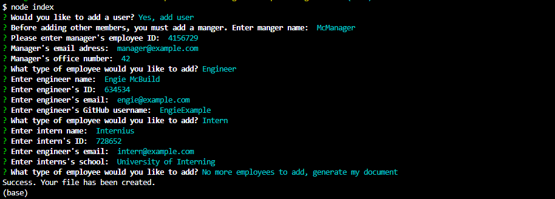
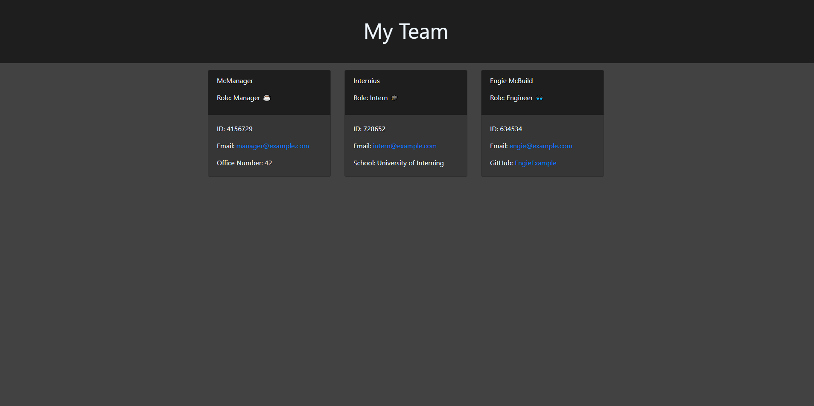

# Team Employee Card Generator

# Description

This project allows you to generate a basic HTML page, complete with pre-made styling that will display cards for a manager, as well as a team of engineers, and interns. It will generate links to their GitHub profiles, emails, etc. with just a couple prompts through a command line.

# Table of Contents

- [Description](#Description)

- [Installation](#Installation)

- [Usage Information](#Usage-Information)

- [Contribution guidelines](#Contribution-guidelines)

- [Test instructions](#Test-instructions)

- [License](#License)

# Installation

To install, simply clone the repository and install the related dependencies.

# Usage Information

To use, open the folder in an integrated terminal and run node index, then follow the instructions from the prompts. Once complete, your file, named "index.html" will be generated in the "output" folder. Everything else in that folder is related to it's styling.

# Contribution guidelines

All contributions to this project are welcome. Send me a message if you have any questions.

# Examples

- A command line series of prompts a user will recieve while running this app.

- A document generated from the answers to these prompts (More cards can be added).

- A video example of this projects available Jest testing
- https://drive.google.com/file/d/1n9AM0Gx9sBd_f-DRyQR64SXsSgGpMuqO/view

- A video example of how to use this project
- https://drive.google.com/file/d/1BbAdkIJK3YTkKzjuXMbCxwdYuJ1kjG_F/view

# License
    
- [MIT] https://www.mit.edu/~amini/LICENSE.md

# Questions?

- GitHub: jarenella

- Email: jamesa122333@gmail.com

